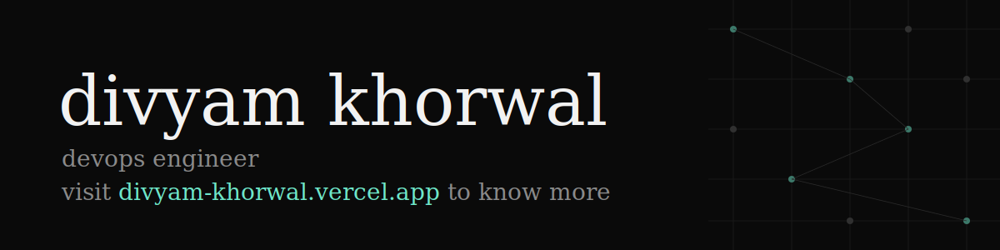

[divyam-khorwal.vercel.app](https://divyam-khorwal.vercel.app/) · [divyamkhorwal18@gmail.com](mailto:divyamkhorwal18@gmail.com)

 

## Stack

 

## GitHub

 
 

## Elsewhere

<a href="mailto:divyamkhorwal18@gmail.com">Email</a> ·
<a href="#">LinkedIn</a> ·
<a href="https://twitter.com/divyam_khorwal">Twitter</a> ·
<a href="https://divyam-khorwal.vercel.app/">Portfolio</a>

Off the clock, I play guitar and ukulele.
